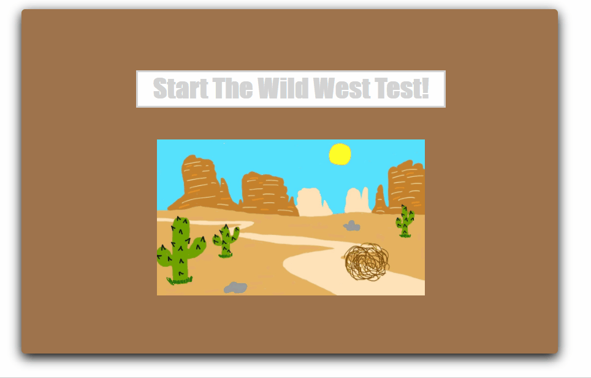

# The Wild West Test

## Our Mission
The Wild West Test is our first hackathon project. It is a game that seeks to teach children word-picture association by using a fun Wild West theme!

## Cool Features
* Hand-drawn images
* Timer
* Score/progress counter

## Demonstration

## How to Use
* Download the files
* Open the HTML file in your browser & enjoy!
